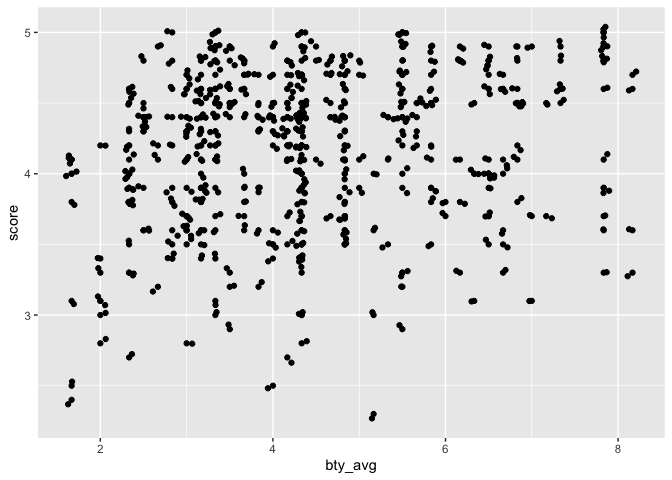
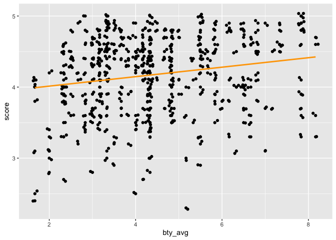
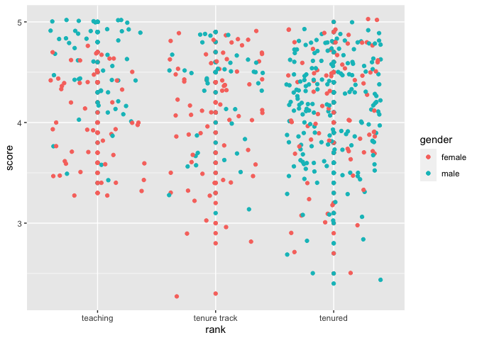

Lab 09 - Grading the professor, Pt. 1
================
Elayna Seago
03/15/22

### Load packages and data

``` r
library(tidyverse) 
library(tidymodels)
library(openintro)
```

### Exercise 1

Yes, the distribution of scores is skewed negatively. The majority of
students evaluate professors as performing well. I expected to see more
of a binomial distribution because I thought students who really liked
or really dislike the course would be the primary respondents.

``` r
evals %>%
  ggplot(aes(x = score)) +
  geom_histogram()
```

    ## `stat_bin()` using `bins = 30`. Pick better value with `binwidth`.

<!-- -->

### Exercise 2

There does not really appear to be much of a linear relationship here.

``` r
evals %>%
  ggplot(aes(x = bty_avg , y = score)) +
  geom_point()
```

<!-- -->

# Exercise 3

The original graph hid some repeat points on the right side of the
graph. The relationship looks a little more positive and linear now.
Jitter adds a little random shift to the points to minimize overlap.

``` r
evals %>%
  ggplot(aes(x = bty_avg , y = score)) +
  geom_point()+
  geom_jitter()
```

<!-- -->

# Exercise 4

score = 3.88 + bty_avg\*.067

``` r
m_bty <- lm(score ~ bty_avg, data=evals)  

print(m_bty)
```

    ## 
    ## Call:
    ## lm(formula = score ~ bty_avg, data = evals)
    ## 
    ## Coefficients:
    ## (Intercept)      bty_avg  
    ##     3.88034      0.06664

``` r
summary(m_bty)
```

    ## 
    ## Call:
    ## lm(formula = score ~ bty_avg, data = evals)
    ## 
    ## Residuals:
    ##     Min      1Q  Median      3Q     Max 
    ## -1.9246 -0.3690  0.1420  0.3977  0.9309 
    ## 
    ## Coefficients:
    ##             Estimate Std. Error t value Pr(>|t|)    
    ## (Intercept)  3.88034    0.07614   50.96  < 2e-16 ***
    ## bty_avg      0.06664    0.01629    4.09 5.08e-05 ***
    ## ---
    ## Signif. codes:  0 '***' 0.001 '**' 0.01 '*' 0.05 '.' 0.1 ' ' 1
    ## 
    ## Residual standard error: 0.5348 on 461 degrees of freedom
    ## Multiple R-squared:  0.03502,    Adjusted R-squared:  0.03293 
    ## F-statistic: 16.73 on 1 and 461 DF,  p-value: 5.083e-05

# Exercise 5

``` r
evals %>%
  ggplot(aes(x = bty_avg , y = score)) +
  geom_point()+
  geom_jitter()+
  geom_smooth( method = lm , se = FALSE , color = "orange")
```

    ## `geom_smooth()` using formula 'y ~ x'

<!-- -->

# Exercise 6

The slope is .0664, so for every 1 point a professors attractiveness
rating goes up, there overall evaluation score is expected to increase
.0664. # Exercise 7 The intercept is 3.88, so a professor with an
attractiveness rating of 0 would still be expected to have an overall
rating of 3.88. # Exercise 8

``` r
summary(m_bty)$r.squared
```

    ## [1] 0.03502226

The R squared is .035 and it tells us how much variation in overall
score is explained by beauty rating.

# Exercise 9

``` r
m_gen <- lm(score ~ gender, data=evals)  

print(m_gen)
```

    ## 
    ## Call:
    ## lm(formula = score ~ gender, data = evals)
    ## 
    ## Coefficients:
    ## (Intercept)   gendermale  
    ##      4.0928       0.1415

``` r
summary(m_gen)
```

    ## 
    ## Call:
    ## lm(formula = score ~ gender, data = evals)
    ## 
    ## Residuals:
    ##      Min       1Q   Median       3Q      Max 
    ## -1.83433 -0.36357  0.06567  0.40718  0.90718 
    ## 
    ## Coefficients:
    ##             Estimate Std. Error t value Pr(>|t|)    
    ## (Intercept)  4.09282    0.03867 105.852  < 2e-16 ***
    ## gendermale   0.14151    0.05082   2.784  0.00558 ** 
    ## ---
    ## Signif. codes:  0 '***' 0.001 '**' 0.01 '*' 0.05 '.' 0.1 ' ' 1
    ## 
    ## Residual standard error: 0.5399 on 461 degrees of freedom
    ## Multiple R-squared:  0.01654,    Adjusted R-squared:  0.01441 
    ## F-statistic: 7.753 on 1 and 461 DF,  p-value: 0.005583

# Exercise 10

males: score = 4.09 + (1\*.1415)

females: score = 4.09 + (0\*.1415)

``` r
evals %>%
  ggplot(aes(x = gender , y = score ,  color = gender)) +
  geom_point()
```

<!-- -->

# Exercise 11

#score = 4.28 + (-.1297*x1) + (-.1452*x2)

teaching track: score= 4.28 + (0) + (0)

tenure track: score = 4.28 + (1\*-.1297) + (0)

tenured: score = 4.28 + (0) + (1\*-.1452)

the intercept = 4.28, this is a professors score at level 0 0 (aka
teaching track) slope 1 = -.1297, this is how much a professors score
decreases at level 1 0 (in the contrast matrix, this is a tenure track
professor) slope 2 = -.1452, this is how much a professors score
decreases at level 0 1 (tenured)

``` r
m_rank <- lm(score ~ rank, data=evals)  

print(m_rank)
```

    ## 
    ## Call:
    ## lm(formula = score ~ rank, data = evals)
    ## 
    ## Coefficients:
    ##      (Intercept)  ranktenure track       ranktenured  
    ##           4.2843           -0.1297           -0.1452

``` r
summary(m_rank)
```

    ## 
    ## Call:
    ## lm(formula = score ~ rank, data = evals)
    ## 
    ## Residuals:
    ##     Min      1Q  Median      3Q     Max 
    ## -1.8546 -0.3391  0.1157  0.4305  0.8609 
    ## 
    ## Coefficients:
    ##                  Estimate Std. Error t value Pr(>|t|)    
    ## (Intercept)       4.28431    0.05365  79.853   <2e-16 ***
    ## ranktenure track -0.12968    0.07482  -1.733   0.0837 .  
    ## ranktenured      -0.14518    0.06355  -2.284   0.0228 *  
    ## ---
    ## Signif. codes:  0 '***' 0.001 '**' 0.01 '*' 0.05 '.' 0.1 ' ' 1
    ## 
    ## Residual standard error: 0.5419 on 460 degrees of freedom
    ## Multiple R-squared:  0.01163,    Adjusted R-squared:  0.007332 
    ## F-statistic: 2.706 on 2 and 460 DF,  p-value: 0.06786

``` r
head(model.matrix(m_rank), 20) 
```

    ##    (Intercept) ranktenure track ranktenured
    ## 1            1                1           0
    ## 2            1                1           0
    ## 3            1                1           0
    ## 4            1                1           0
    ## 5            1                0           1
    ## 6            1                0           1
    ## 7            1                0           1
    ## 8            1                0           1
    ## 9            1                0           1
    ## 10           1                0           1
    ## 11           1                0           1
    ## 12           1                0           1
    ## 13           1                0           1
    ## 14           1                0           1
    ## 15           1                0           1
    ## 16           1                0           1
    ## 17           1                0           1
    ## 18           1                1           0
    ## 19           1                1           0
    ## 20           1                1           0

``` r
evals %>%
  ggplot(aes(x = rank , y = score ,  color = gender)) +
  geom_point()+
  geom_jitter()
```

<!-- -->

# Exercise 12

``` r
evals_relevel <- evals %>% 
  mutate(rank_relevel = relevel(rank, ref = "tenure track"))
```

# Exercise 13

``` r
m_rank_relevel <- lm(score ~ rank_relevel, data=evals_relevel)
summary(m_rank_relevel)
```

    ## 
    ## Call:
    ## lm(formula = score ~ rank_relevel, data = evals_relevel)
    ## 
    ## Residuals:
    ##     Min      1Q  Median      3Q     Max 
    ## -1.8546 -0.3391  0.1157  0.4305  0.8609 
    ## 
    ## Coefficients:
    ##                      Estimate Std. Error t value Pr(>|t|)    
    ## (Intercept)           4.15463    0.05214  79.680   <2e-16 ***
    ## rank_relevelteaching  0.12968    0.07482   1.733   0.0837 .  
    ## rank_releveltenured  -0.01550    0.06228  -0.249   0.8036    
    ## ---
    ## Signif. codes:  0 '***' 0.001 '**' 0.01 '*' 0.05 '.' 0.1 ' ' 1
    ## 
    ## Residual standard error: 0.5419 on 460 degrees of freedom
    ## Multiple R-squared:  0.01163,    Adjusted R-squared:  0.007332 
    ## F-statistic: 2.706 on 2 and 460 DF,  p-value: 0.06786

#initial lm teaching track: score= 4.28 + (0)=4.28

tenure track: score = 4.28 + (1\*-.1297)=4.15

tenured: score = 4.28 + (1\*-.1452)=4.13

#new lm teaching track: score= 4.15 + (1\*.129)=4.279

tenure track: score= 4.15 + (0)=4.15

tenured: score= 4.15 + (1\*-.015)=4.13

the intercept = 4.15, this is a professors score at level 0 0 (aka
tenure track) slope 1 = .1297, this is how much a professors score
increases at level 1 0 (in the new contrast matrix, this is a teaching
track professor) slope 2 = -.015, this is how much a professors score
decreases at level 0 1 (tenured) R2=.007, this means the linear model
shows that teaching position explains .7% of the variance in score.

# exercise 14

``` r
evals <- evals %>% 
  mutate(tenure_eligible = recode(rank, "tenure track" = "yes" ,
                                  "tenured" = "yes" ,
                                  "teaching" = "no"
  ))
```

``` r
head(evals)
```

    ## # A tibble: 6 × 24
    ##   course_id prof_id score rank     ethnicity gender language   age cls_perc_eval
    ##       <int>   <int> <dbl> <fct>    <fct>     <fct>  <fct>    <int>         <dbl>
    ## 1         1       1   4.7 tenure … minority  female english     36          55.8
    ## 2         2       1   4.1 tenure … minority  female english     36          68.8
    ## 3         3       1   3.9 tenure … minority  female english     36          60.8
    ## 4         4       1   4.8 tenure … minority  female english     36          62.6
    ## 5         5       2   4.6 tenured  not mino… male   english     59          85  
    ## 6         6       2   4.3 tenured  not mino… male   english     59          87.5
    ## # … with 15 more variables: cls_did_eval <int>, cls_students <int>,
    ## #   cls_level <fct>, cls_profs <fct>, cls_credits <fct>, bty_f1lower <int>,
    ## #   bty_f1upper <int>, bty_f2upper <int>, bty_m1lower <int>, bty_m1upper <int>,
    ## #   bty_m2upper <int>, bty_avg <dbl>, pic_outfit <fct>, pic_color <fct>,
    ## #   tenure_eligible <fct>

#exercise 15

``` r
m_tenure_eligible <- lm(score ~ tenure_eligible, data=evals)
summary(m_tenure_eligible)
```

    ## 
    ## Call:
    ## lm(formula = score ~ tenure_eligible, data = evals)
    ## 
    ## Residuals:
    ##     Min      1Q  Median      3Q     Max 
    ## -1.8438 -0.3438  0.1157  0.4360  0.8562 
    ## 
    ## Coefficients:
    ##                    Estimate Std. Error t value Pr(>|t|)    
    ## (Intercept)          4.2843     0.0536  79.934   <2e-16 ***
    ## tenure_eligibleyes  -0.1406     0.0607  -2.315    0.021 *  
    ## ---
    ## Signif. codes:  0 '***' 0.001 '**' 0.01 '*' 0.05 '.' 0.1 ' ' 1
    ## 
    ## Residual standard error: 0.5413 on 461 degrees of freedom
    ## Multiple R-squared:  0.0115, Adjusted R-squared:  0.009352 
    ## F-statistic: 5.361 on 1 and 461 DF,  p-value: 0.02103

score = 4.28 + (-.14\*x) for tenure eligible, that means 4.14 and for
tenure non-eligible, 4.28. The slope is the amount that score goes down
for those who are tenure eligible. Since tenure eligibility is
categorical, this shows the average score for those two groups.
R-squared is .009, so tenure eligibility explains .9% of the variance in
score.
